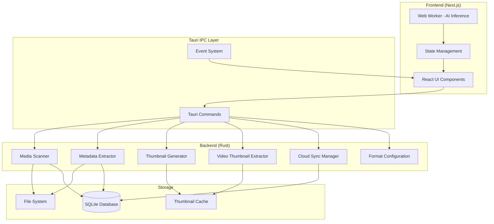

# Design Document - Cura Photo Manager

## Overview

Cura is a desktop media management application built on a hybrid architecture combining Rust (Tauri backend) for high-performance image and video processing with Next.js (React frontend) for a modern, responsive user interface. The system leverages browser-based AI models through Transformers.js for intelligent media classification while maintaining native performance for I/O-intensive operations. The application supports both images and videos, with intelligent thumbnail generation from video frames.

### Architecture Philosophy

The design follows a clear separation of concerns:
- **Rust Backend**: Handles all filesystem operations, image and video processing, metadata extraction, and video thumbnail generation
- **Next.js Frontend**: Manages UI rendering, user interactions, and AI inference
- **IPC Bridge**: Tauri's command system provides type-safe communication between layers
- **Local-First**: All core functionality works offline; cloud sync is an optional enhancement
- **Unified Media Handling**: Images and videos are treated as first-class media types with format-specific processing pipelines

### Key Design Decisions

1. **Dual Thumbnail Strategy**: Generate both 150px (grid) and 600px (detail) thumbnails to optimize for different viewing contexts
2. **Video Thumbnail Extraction**: Extract video thumbnails from the frame at 5 seconds (or first frame if video is shorter) using FFmpeg
3. **Configurable Format Support**: Allow users to select which image and video formats to import, with sensible defaults for all common formats
4. **Parallel Processing**: Use Rayon for CPU-bound tasks to maximize throughput on multi-core systems
5. **Browser-Based AI**: Run inference in web workers to avoid blocking the UI thread
6. **Incremental Indexing**: Process media files in batches with progress feedback rather than blocking on large imports
7. **Checksum-Based Sync**: Use content hashing to avoid redundant uploads to Google Drive
8. **Media Type Distinction**: Store media type (image/video) in database to enable type-specific filtering and processing

## Architecture

### System Components



### Data Flow

**Media Import Flow**:
1. User selects folder via Tauri dialog
2. User can optionally configure which image and video formats to import (or use defaults)
3. Rust scanner traverses directory tree in parallel
4. For each media file:
   - Determine media type (image or video) based on extension
   - Extract metadata (EXIF for images, video metadata for videos)
   - Generate thumbnails:
     - Images: Generate small (150px) and medium (600px) thumbnails directly
     - Videos: Extract frame at 5 seconds using FFmpeg, then generate thumbnails from that frame
   - Store metadata, paths, and media type in SQLite
   - Emit progress event to frontend
5. Frontend receives thumbnail paths and displays grid with both images and videos
6. AI worker processes thumbnails in background queue
7. Tags are saved to database as they're generated

**Search Flow**:
1. User enters search query in UI
2. If text-based: Query SQLite for matching tags/metadata
3. If semantic (CLIP): Compute query embedding in worker
4. Compare against stored image embeddings
5. Return ranked results to UI

**Cloud Sync Flow**:
1. User authenticates via OAuth 2.0 (browser popup)
2. Tokens stored in system keychain via Rust
3. On sync request:
   - Query database for images not yet synced
   - Compute checksum for each image
   - Compare with Drive API to identify new files
   - Stream upload new/modified images
   - Update sync status in database

## Components and Interfaces

### Rust Backend Components

#### Media Scanner

**Responsibility**: Discover image and video files in directory trees based on user-configured format preferences

**Interface**:
```rust
#[tauri::command]
async fn scan_folder(path: String, config: Option<FormatConfig>) -> Result<ScanResult, String> {
    // Returns list of discovered media paths with type information
}

struct ScanResult {
    media_files: Vec<MediaFile>,
    total_count: usize,
    errors: Vec<ScanError>,
}

struct MediaFile {
    path: String,
    media_type: MediaType,
}

enum MediaType {
    Image,
    Video,
}

struct FormatConfig {
    image_formats: Vec<String>,  // e.g., ["jpg", "png", "heic", "raw"]
    video_formats: Vec<String>,  // e.g., ["mp4", "mov", "avi", "mkv"]
}
```

**Implementation Details**:
- Use `walkdir` crate for recursive traversal
- Default image formats: `.jpg`, `.jpeg`, `.png`, `.heic`, `.raw`, `.cr2`, `.nef`, `.dng`, `.arw`
- Default video formats: `.mp4`, `.mov`, `.avi`, `.mkv`, `.webm`, `.flv`, `.wmv`, `.m4v`
- Filter files based on user-configured format preferences (or use defaults)
- Determine media type based on extension
- Use Rayon's `par_bridge()` to parallelize file discovery
- Emit progress events every 100 files processed
- Return both images and videos in unified result structure

#### Metadata Extractor

**Responsibility**: Read EXIF data and file system metadata

**Interface**:
```rust
#[tauri::command]
async fn extract_metadata(image_path: String) -> Result<ImageMetadata, String> {
    // Returns structured metadata
}

struct ImageMetadata {
    path: String,
    capture_date: Option<DateTime<Utc>>,
    camera_make: Option<String>,
    camera_model: Option<String>,
    gps_latitude: Option<f64>,
    gps_longitude: Option<f64>,
    width: u32,
    height: u32,
    file_size: u64,
    file_modified: DateTime<Utc>,
}
```

**Implementation Details**:
- Use `kamadak-exif` crate for EXIF parsing
- Fallback to file system timestamps if EXIF date missing
- Parse GPS coordinates from EXIF rational format to decimal degrees
- Handle orientation tag to determine correct dimensions
- Target: <100ms per image on average

#### Thumbnail Generator

**Responsibility**: Create cached preview images

**Interface**:
```rust
#[tauri::command]
async fn generate_thumbnails(image_path: String) -> Result<ThumbnailPaths, String> {
    // Returns paths to generated thumbnails
}

struct ThumbnailPaths {
    small: String,  // 150px width
    medium: String, // 600px width
}
```

**Implementation Details**:
- Use `image` crate for decoding and resizing
- For HEIC: Use `libheif-rs` to decode, then convert to JPEG
- For RAW: Use `rawloader` crate to decode, then convert to JPEG
- Apply EXIF orientation transformation before resizing
- Use Lanczos3 filter for high-quality downsampling
- Cache location: `{AppData}/cura/thumbnails/{checksum}_{size}.jpg`
- Skip generation if thumbnail exists and source file unchanged (compare mtime)

#### Video Thumbnail Extractor

**Responsibility**: Extract frames from videos and create thumbnail images

**Interface**:
```rust
#[tauri::command]
async fn generate_video_thumbnails(video_path: String) -> Result<ThumbnailPaths, String> {
    // Returns paths to generated thumbnails from video frame
}

struct ThumbnailPaths {
    small: String,  // 150px width
    medium: String, // 600px width
}
```

**Implementation Details**:
- Use FFmpeg (via `ffmpeg-next` or `ffmpeg-sidecar` crate) to extract video frames
- Extract frame at 5 seconds into the video (or first frame if video duration < 5 seconds)
- Command: `ffmpeg -ss 5 -i {video_path} -vframes 1 -f image2pipe -`
- Decode extracted frame using `image` crate
- Generate two thumbnail sizes: 150px width (small) and 600px width (medium)
- Use Lanczos3 filter for high-quality downsampling
- Cache location: `{AppData}/cura/thumbnails/{checksum}_{size}.jpg`
- Skip generation if thumbnail exists and source file unchanged (compare mtime)
- Handle videos shorter than 5 seconds by extracting first frame
- Handle videos without video streams by returning error
- Target: <500ms per video on average (depends on video codec and size)

#### Cloud Sync Manager

**Responsibility**: Handle Google Drive authentication and file uploads

**Interface**:
```rust
#[tauri::command]
async fn authenticate_google_drive() -> Result<AuthStatus, String> {
    // Opens browser for OAuth, returns success/failure
}

#[tauri::command]
async fn sync_to_drive(image_ids: Vec<i64>) -> Result<SyncResult, String> {
    // Uploads specified images to Google Drive
}

struct SyncResult {
    uploaded: usize,
    skipped: usize,
    failed: Vec<SyncError>,
}
```

**Implementation Details**:
- Use `oauth2` crate for OAuth 2.0 flow
- Store tokens in system keychain via `keyring` crate
- Use `reqwest` for HTTP requests to Drive API
- Stream file uploads to minimize memory usage
- Compute SHA-256 checksum for deduplication
- Implement exponential backoff for retries (3 attempts max)
- Emit progress events with percentage and current file

#### Format Configuration Manager

**Responsibility**: Manage user preferences for supported image and video formats

**Interface**:
```rust
#[tauri::command]
async fn get_format_config() -> Result<FormatConfig, String> {
    // Returns current format configuration
}

#[tauri::command]
async fn set_format_config(config: FormatConfig) -> Result<(), String> {
    // Saves format configuration to settings
}

#[tauri::command]
async fn get_default_formats() -> Result<FormatConfig, String> {
    // Returns default format configuration
}

struct FormatConfig {
    image_formats: Vec<String>,
    video_formats: Vec<String>,
}
```

**Implementation Details**:
- Store format preferences in application settings file
- Provide sensible defaults:
  - Images: jpg, jpeg, png, heic, raw, cr2, nef, dng, arw, webp, gif, bmp, tiff
  - Videos: mp4, mov, avi, mkv, webm, flv, wmv, m4v, mpg, mpeg, 3gp
- Validate format strings (lowercase, no dots)
- Persist changes immediately to settings file
- Emit event when configuration changes to trigger UI updates

### Frontend Components

#### Format Selection UI

**Responsibility**: Allow users to configure which media formats to import

**Interface**:
```typescript
interface FormatSelectionProps {
  currentConfig: FormatConfig;
  onConfigChange: (config: FormatConfig) => void;
}

interface FormatConfig {
  imageFormats: string[];
  videoFormats: string[];
}

function FormatSelection(props: FormatSelectionProps): JSX.Element
```

**Implementation Details**:
- Display two sections: Image Formats and Video Formats
- Show checkboxes for each supported format
- Provide "Select All" / "Deselect All" buttons for each section
- Display format counts (e.g., "12 of 15 image formats selected")
- Show file extension examples for each format
- Persist changes via Tauri command to backend
- Display in Settings page and optionally in folder import dialog
- Validate that at least one format is selected in each category

#### AI Classifier

**Responsibility**: Run image classification inference

**Interface**:
```typescript
// Runs in Web Worker
interface ClassificationRequest {
  thumbnailPath: string;
  imageId: number;
  modelType: 'clip' | 'mobilenet';
}

interface ClassificationResult {
  imageId: number;
  tags: Array<{
    label: string;
    confidence: number;
  }>;
}

async function classifyImage(request: ClassificationRequest): Promise<ClassificationResult>
```

**Implementation Details**:
- Load model once on worker initialization
- Use `@xenova/transformers` library
- For CLIP: Generate embeddings for both image and text queries
- For MobileNet: Use top-5 predictions above 0.3 confidence threshold
- Process images in queue (max 2 concurrent to limit memory)
- Send results back to main thread via postMessage
- Main thread saves tags to database via Tauri command

#### UI Components

**Photo Grid**:
- Use `react-window` for virtual scrolling
- Display small thumbnails (150px) in responsive grid
- Show media type indicator (video icon overlay for videos)
- Show skeleton loaders while thumbnails load
- Support infinite scroll for large collections

**Photo Detail View**:
- Display medium thumbnail (600px) initially
- For images: Lazy load full-resolution image on demand
- For videos: Show video player with controls (play, pause, seek)
- Show metadata panel with EXIF/video information
- Display AI-generated tags with confidence scores
- Provide map view if GPS coordinates available
- Show media type and format information

**Search Interface**:
- Text input with debounced search (300ms)
- Filter chips for tags, date ranges, locations, media type (image/video)
- Toggle between tag search and semantic search (if CLIP enabled)
- Display result count and search time

### Database Schema

**SQLite Tables**:

```sql
CREATE TABLE images (
    id INTEGER PRIMARY KEY AUTOINCREMENT,
    path TEXT NOT NULL UNIQUE,
    media_type TEXT NOT NULL DEFAULT 'image', -- 'image' or 'video'
    thumbnail_small TEXT NOT NULL,
    thumbnail_medium TEXT NOT NULL,
    checksum TEXT NOT NULL,
    capture_date DATETIME,
    camera_make TEXT,
    camera_model TEXT,
    gps_latitude REAL,
    gps_longitude REAL,
    width INTEGER NOT NULL,
    height INTEGER NOT NULL,
    duration_seconds REAL, -- NULL for images, video duration for videos
    video_codec TEXT, -- NULL for images, codec name for videos
    file_size INTEGER NOT NULL,
    file_modified DATETIME NOT NULL,
    created_at DATETIME DEFAULT CURRENT_TIMESTAMP,
    synced_at DATETIME,
    sync_status TEXT DEFAULT 'pending'
);

CREATE TABLE tags (
    id INTEGER PRIMARY KEY AUTOINCREMENT,
    image_id INTEGER NOT NULL,
    label TEXT NOT NULL,
    confidence REAL NOT NULL,
    created_at DATETIME DEFAULT CURRENT_TIMESTAMP,
    FOREIGN KEY (image_id) REFERENCES images(id) ON DELETE CASCADE
);

CREATE TABLE embeddings (
    id INTEGER PRIMARY KEY AUTOINCREMENT,
    image_id INTEGER NOT NULL UNIQUE,
    embedding BLOB NOT NULL,
    model_version TEXT NOT NULL,
    created_at DATETIME DEFAULT CURRENT_TIMESTAMP,
    FOREIGN KEY (image_id) REFERENCES images(id) ON DELETE CASCADE
);

CREATE INDEX idx_images_path ON images(path);
CREATE INDEX idx_images_media_type ON images(media_type);
CREATE INDEX idx_images_capture_date ON images(capture_date);
CREATE INDEX idx_images_sync_status ON images(sync_status);
CREATE INDEX idx_tags_image_id ON tags(image_id);
CREATE INDEX idx_tags_label ON tags(label);
```

**Schema Changes for Video Support**:
- Added `media_type` column to distinguish between images and videos
- Added `duration_seconds` column for video duration
- Added `video_codec` column for video codec information
- Added index on `media_type` for efficient filtering
- Table name remains `images` for backward compatibility (represents all media)

## Data Models

### Core Domain Models

**Image Record**:
```typescript
interface ImageRecord {
  id: number;
  path: string;
  mediaType: 'image' | 'video';
  thumbnailSmall: string;
  thumbnailMedium: string;
  checksum: string;
  metadata: MediaMetadata;
  tags: Tag[];
  syncStatus: 'pending' | 'synced' | 'failed';
  syncedAt?: Date;
}

interface MediaMetadata {
  captureDate?: Date;
  cameraMake?: string;
  cameraModel?: string;
  gpsCoordinates?: {
    latitude: number;
    longitude: number;
  };
  dimensions: {
    width: number;
    height: number;
  };
  // Video-specific metadata
  durationSeconds?: number;
  videoCodec?: string;
  // Common metadata
  fileSize: number;
  fileModified: Date;
}

interface Tag {
  label: string;
  confidence: number;
}
```

**Search Query**:
```typescript
interface SearchQuery {
  text?: string;
  tags?: string[];
  dateRange?: {
    start: Date;
    end: Date;
  };
  location?: {
    latitude: number;
    longitude: number;
    radiusKm: number;
  };
  cameraModel?: string;
  mediaType?: 'image' | 'video' | 'all'; // Filter by media type
  semantic?: boolean; // Use CLIP semantic search
}

interface SearchResult {
  images: ImageRecord[];
  totalCount: number;
  searchTimeMs: number;
}
```

**Format Configuration**:
```typescript
interface FormatConfig {
  imageFormats: string[];
  videoFormats: string[];
}

const DEFAULT_FORMAT_CONFIG: FormatConfig = {
  imageFormats: ['jpg', 'jpeg', 'png', 'heic', 'raw', 'cr2', 'nef', 'dng', 'arw', 'webp', 'gif', 'bmp', 'tiff'],
  videoFormats: ['mp4', 'mov', 'avi', 'mkv', 'webm', 'flv', 'wmv', 'm4v', 'mpg', 'mpeg', '3gp']
};
```

**Sync Configuration**:
```typescript
interface SyncConfig {
  enabled: boolean;
  autoSync: boolean;
  syncInterval: number; // minutes
  uploadQuality: 'original' | 'high' | 'medium';
  excludePatterns: string[]; // glob patterns
}
```

### State Management

**Frontend State**:
```typescript
interface AppState {
  images: {
    items: Map<number, ImageRecord>;
    selectedFolder: string | null;
    viewMode: 'grid' | 'detail';
    selectedImageId: number | null;
    mediaTypeFilter: 'all' | 'image' | 'video'; // Filter displayed media
  };
  
  search: {
    query: SearchQuery;
    results: number[];
    isSearching: boolean;
  };
  
  ai: {
    isProcessing: boolean;
    queueSize: number;
    processedCount: number;
    modelLoaded: boolean;
  };
  
  sync: {
    isAuthenticated: boolean;
    isSyncing: boolean;
    progress: {
      current: number;
      total: number;
      currentFile: string;
    };
  };
  
  settings: {
    thumbnailCachePath: string;
    aiModel: 'clip' | 'mobilenet';
    syncConfig: SyncConfig;
    formatConfig: FormatConfig; // User-configured format preferences
  };
}
```


## Correctness Properties

*A property is a characteristic or behavior that should hold true across all valid executions of a system—essentially, a formal statement about what the system should do. Properties serve as the bridge between human-readable specifications and machine-verifiable correctness guarantees.*

### Property 1: Recursive Image Discovery

*For any* directory tree containing image files, scanning should discover all image files in all subdirectories and return a list where each entry contains both an original image path and corresponding thumbnail paths.

**Validates: Requirements 1.2, 1.5**

### Property 2: Format Support Completeness

*For any* valid image file in JPEG, PNG, HEIC, or RAW format, the system should successfully process it without errors.

**Validates: Requirements 1.4**

### Property 3: Error Isolation

*For any* batch of files containing some unreadable files, processing should continue for all readable files and the final result should include both successful results and logged errors for failed files.

**Validates: Requirements 1.6, 11.3**

### Property 4: Metadata Field Completeness

*For any* image with EXIF data, the extracted metadata should include capture date, camera device, GPS coordinates (if present), and image dimensions.

**Validates: Requirements 2.1**

### Property 5: Database Round-Trip Consistency

*For any* image with extracted metadata and generated tags, storing to the database and then querying back should return equivalent metadata and tags linked to the correct image path.

**Validates: Requirements 2.3, 4.3, 6.1**

### Property 6: GPS Coordinate Format

*For any* image with GPS EXIF data, the parsed coordinates should be in decimal degrees format (not degrees-minutes-seconds), with latitude in range [-90, 90] and longitude in range [-180, 180].

**Validates: Requirements 2.4**

### Property 7: Dual Thumbnail Generation

*For any* processed image, thumbnail generation should produce exactly two files: one with 150px width (small) and one with 600px width (medium), both maintaining the original aspect ratio.

**Validates: Requirements 3.1**

### Property 8: Format Conversion for Compatibility

*For any* HEIC or RAW format input image, the generated thumbnails should be in JPEG format to ensure browser compatibility.

**Validates: Requirements 3.2**

### Property 9: Thumbnail Generation Idempotence

*For any* image, generating thumbnails twice without modifying the source image should skip regeneration on the second attempt and return the existing thumbnail paths.

**Validates: Requirements 3.4, 10.3**

### Property 10: Orientation Preservation

*For any* image with an EXIF orientation tag, the generated thumbnails should be rotated correctly according to the orientation value.

**Validates: Requirements 3.6**

### Property 11: Classification Output Structure

*For any* image processed by the AI classifier, the result should contain at least one tag with a label and confidence score.

**Validates: Requirements 4.2**

### Property 12: Semantic Search with CLIP

*For any* natural language search query when using the CLIP model, the system should return a ranked list of images based on semantic similarity.

**Validates: Requirements 4.6**

### Property 13: Search Result Ordering

*For any* search results, images should be ordered by relevance score in descending order (highest relevance first).

**Validates: Requirements 5.2**

### Property 14: Database Query Filtering

*For any* filter criteria (date range, location, tags, or device), querying the database should return only images that match all specified criteria.

**Validates: Requirements 6.2**

### Property 15: Referential Integrity

*For any* image record, deleting the image from the database should automatically cascade delete all associated tags due to foreign key constraints.

**Validates: Requirements 6.4**

### Property 16: Cleanup on Deletion

*For any* image deleted from disk, the system should remove the corresponding database record and all cached thumbnail files.

**Validates: Requirements 6.5**

### Property 17: Path Update on Move

*For any* image moved within monitored folders, the system should update the existing database record's path rather than creating a duplicate entry (based on checksum matching).

**Validates: Requirements 6.6**

### Property 18: Token Persistence

*For any* successful OAuth authentication, the access_token and refresh_token should be stored in the system keychain and be retrievable in subsequent sessions.

**Validates: Requirements 7.2**

### Property 19: Automatic Token Refresh

*For any* expired access_token, the system should automatically obtain a new access_token using the refresh_token without requiring user re-authentication.

**Validates: Requirements 7.4**

### Property 20: Checksum-Based Deduplication

*For any* set of images selected for backup, only images whose checksums do not exist in Google Drive should be uploaded.

**Validates: Requirements 8.1**

### Property 21: Sync Status Tracking

*For any* image successfully uploaded to Google Drive, the database should record the sync status as "synced" and store the sync timestamp.

**Validates: Requirements 8.3**

### Property 22: Error Logging Structure

*For any* error that occurs in the system, the log entry should contain a timestamp, component name, and stack trace.

**Validates: Requirements 11.1**

### Property 23: Data Preservation on Crash

*For any* application crash, restarting the application should show all previously imported images and metadata without data loss or corruption.

**Validates: Requirements 11.5**

### Property 24: Settings Persistence Round-Trip

*For any* configuration change, saving the settings and restarting the application should preserve the changed values.

**Validates: Requirements 12.2, 12.3**

### Property 25: Settings Validation

*For any* invalid configuration value, the system should reject the input and provide a descriptive error message explaining why the value is invalid.

**Validates: Requirements 12.4**

### Property 26: Video Format Support

*For any* valid video file in MP4, MOV, AVI, or MKV format (or other configured formats), the system should successfully process it and extract a thumbnail without errors.

**Validates: Requirements 1.4 (extended for video)**

### Property 27: Video Thumbnail Extraction at 5 Seconds

*For any* video file longer than 5 seconds, the thumbnail should be extracted from the frame at exactly 5 seconds into the video.

**Validates: Requirements 3.1 (extended for video)**

### Property 28: Video Thumbnail Extraction for Short Videos

*For any* video file shorter than 5 seconds, the thumbnail should be extracted from the first frame of the video.

**Validates: Requirements 3.1 (extended for video)**

### Property 29: Format Configuration Persistence

*For any* format configuration change (adding or removing image/video formats), saving the configuration and restarting the application should preserve the changed format selections.

**Validates: Requirements 12.2, 12.3 (extended for format config)**

### Property 30: Media Type Filtering

*For any* database query with media type filter (image, video, or all), the results should contain only media files matching the specified type.

**Validates: Requirements 6.2 (extended for media type)**

### Property 31: Video Metadata Extraction

*For any* video file, the extracted metadata should include duration in seconds, video codec, dimensions, and file size.

**Validates: Requirements 2.1 (extended for video)**

### Property 32: Default Format Configuration

*For any* first-time application startup, the system should initialize with default format configuration including all common image and video formats.

**Validates: Requirements 12.5 (extended for format config)**

## Error Handling

### Error Categories

**File System Errors**:
- Unreadable files: Log error, continue processing other files
- Permission denied: Display user-friendly message, suggest checking permissions
- Disk full: Pause operations, notify user, allow cleanup

**Image Processing Errors**:
- Corrupt image data: Log error, display placeholder thumbnail
- Unsupported format: Log warning, skip file
- EXIF parsing failure: Use fallback values (file system metadata)

**Video Processing Errors**:
- FFmpeg not found: Display error message, disable video support
- Video codec not supported: Log warning, display placeholder thumbnail
- Video file corrupt: Log error, display placeholder thumbnail
- Frame extraction failure: Retry with first frame, if still fails use placeholder
- Video too short (< 1 frame): Use placeholder thumbnail

**AI Inference Errors**:
- Model loading failure: Disable AI features, notify user
- Out of memory: Reduce batch size, retry with smaller batches
- Worker thread crash: Restart worker, resume from last checkpoint

**Network Errors**:
- OAuth failure: Display error, allow retry
- Upload failure: Retry with exponential backoff (3 attempts)
- Token refresh failure: Prompt user to re-authenticate

**Database Errors**:
- Schema initialization failure: Display error, prevent app startup
- Query failure: Log error, return empty results
- Constraint violation: Log error, rollback transaction
- Migration failure: Display error with migration details, prevent app startup

### Error Recovery Strategies

**Graceful Degradation**:
- If AI classification fails, app continues with manual tagging
- If cloud sync fails, app continues with local-only mode
- If thumbnail generation fails, display placeholder icons

**Transactional Operations**:
- Database writes use transactions with rollback on error
- Batch operations checkpoint progress for resume capability
- File operations are atomic where possible

**User Communication**:
- Critical errors: Modal dialog with clear explanation
- Non-critical errors: Toast notification with dismiss option
- Background errors: Error log accessible from settings

## Testing Strategy

### Dual Testing Approach

The testing strategy combines unit tests for specific examples and edge cases with property-based tests for universal correctness guarantees. Both approaches are complementary and necessary for comprehensive coverage.

**Unit Tests**:
- Specific examples demonstrating correct behavior
- Edge cases (empty inputs, boundary values, special characters)
- Error conditions and recovery paths
- Integration points between components

**Property-Based Tests**:
- Universal properties that hold for all inputs
- Comprehensive input coverage through randomization
- Minimum 100 iterations per property test
- Each test references its design document property

### Property-Based Testing Configuration

**Library Selection**:
- Rust: Use `proptest` crate for backend components
- TypeScript: Use `fast-check` library for frontend components

**Test Tagging**:
Each property test must include a comment tag:
```rust
// Feature: cura-photo-manager, Property 5: Database Round-Trip Consistency
#[proptest]
fn test_metadata_roundtrip(metadata: ImageMetadata) {
    // Test implementation
}
```

**Iteration Count**:
Configure all property tests to run minimum 100 iterations:
```rust
proptest! {
    #![proptest_config(ProptestConfig::with_cases(100))]
    // Test cases
}
```

### Test Coverage by Component

**Media Scanner**:
- Unit: Test with known directory structures containing images and videos
- Property: Recursive discovery completeness (Property 1)
- Property: Format support for images (Property 2)
- Property: Format support for videos (Property 26)
- Property: Error isolation (Property 3)
- Unit: Test format configuration filtering

**Metadata Extractor**:
- Unit: Test with sample images with known EXIF data
- Unit: Test with sample videos with known metadata
- Property: Metadata field completeness for images (Property 4)
- Property: Video metadata extraction (Property 31)
- Property: GPS coordinate format (Property 6)
- Unit: Test fallback to file system timestamps

**Thumbnail Generator**:
- Unit: Test with sample images of each supported format
- Property: Dual thumbnail generation (Property 7)
- Property: Format conversion (Property 8)
- Property: Idempotence (Property 9)
- Property: Orientation preservation (Property 10)

**Video Thumbnail Extractor**:
- Unit: Test with sample videos of each supported format
- Property: Video thumbnail extraction at 5 seconds (Property 27)
- Property: Video thumbnail extraction for short videos (Property 28)
- Property: Video format support (Property 26)
- Unit: Test FFmpeg integration and error handling
- Unit: Test videos without video streams

**AI Classifier**:
- Unit: Test with known images and expected tags
- Property: Classification output structure (Property 11)
- Property: Semantic search (Property 12)
- Unit: Test worker thread isolation
- Unit: Test classification on video thumbnails

**Database**:
- Property: Round-trip consistency (Property 5)
- Property: Query filtering (Property 14)
- Property: Media type filtering (Property 30)
- Property: Referential integrity (Property 15)
- Property: Cleanup on deletion (Property 16)
- Property: Path update on move (Property 17)
- Unit: Test schema initialization
- Unit: Test database migration for video support

**Format Configuration**:
- Property: Format configuration persistence (Property 29)
- Property: Default format configuration (Property 32)
- Unit: Test format validation
- Unit: Test format selection UI

**Cloud Sync**:
- Unit: Test OAuth flow with mock server
- Property: Token persistence (Property 18)
- Property: Automatic token refresh (Property 19)
- Property: Checksum-based deduplication (Property 20)
- Property: Sync status tracking (Property 21)
- Unit: Test retry logic with exponential backoff
- Unit: Test video file uploads

**Error Handling**:
- Property: Error logging structure (Property 22)
- Property: Data preservation on crash (Property 23)
- Unit: Test each error category with specific scenarios
- Unit: Test video processing error scenarios

**Settings Management**:
- Property: Settings persistence round-trip (Property 24)
- Property: Settings validation (Property 25)
- Unit: Test default values on first run
- Unit: Test format configuration in settings

### Integration Testing

**End-to-End Flows**:
1. Import folder → Scan (images + videos) → Extract metadata → Generate thumbnails → Display grid
2. Select image → Display detail view → Show metadata and tags
3. Select video → Display detail view → Show video player and metadata
4. Configure formats → Scan folder → Verify only selected formats are imported
5. Search by tag → Filter results → Display matches (images and videos)
6. Filter by media type → Display only images or only videos
7. Authenticate Drive → Select media → Upload → Verify sync status

**Performance Testing**:
- Benchmark scanning 10,000 mixed media files (images + videos)
- Measure thumbnail generation throughput for images
- Measure video thumbnail extraction throughput
- Test AI classification batch processing
- Verify search response time under load
- Test FFmpeg performance with various video codecs

### Test Data Generation

**Property Test Generators**:
```rust
// Generate random directory structures
prop_compose! {
    fn arb_directory_tree()(
        depth in 1..5usize,
        files_per_dir in 1..20usize
    ) -> DirectoryTree {
        // Generate random tree structure
    }
}

// Generate random image metadata
prop_compose! {
    fn arb_image_metadata()(
        width in 100..10000u32,
        height in 100..10000u32,
        has_gps in proptest::bool::ANY,
        lat in -90.0..90.0f64,
        lon in -180.0..180.0f64
    ) -> ImageMetadata {
        // Generate random metadata
    }
}
```

**Edge Cases to Cover**:
- Empty directories
- Very large images (>100MB)
- Very large videos (>1GB)
- Videos shorter than 5 seconds
- Videos with no video stream (audio only)
- Videos with unsupported codecs
- Images with missing EXIF data
- Images with corrupt EXIF data
- Unicode characters in file paths
- Very long file paths (>260 characters on Windows)
- Images with unusual aspect ratios
- Images with all 8 EXIF orientation values
- Mixed folders with both images and videos
- Format configuration with no formats selected
- Format configuration with invalid format strings

### Continuous Integration

**CI Pipeline**:
1. Run all unit tests
2. Run all property tests (100 iterations each)
3. Run integration tests
4. Generate coverage report (target: >80%)
5. Run linters and formatters
6. Build release artifacts

**Test Execution Time**:
- Unit tests: <30 seconds
- Property tests: <5 minutes
- Integration tests: <2 minutes
- Total CI time: <10 minutes
