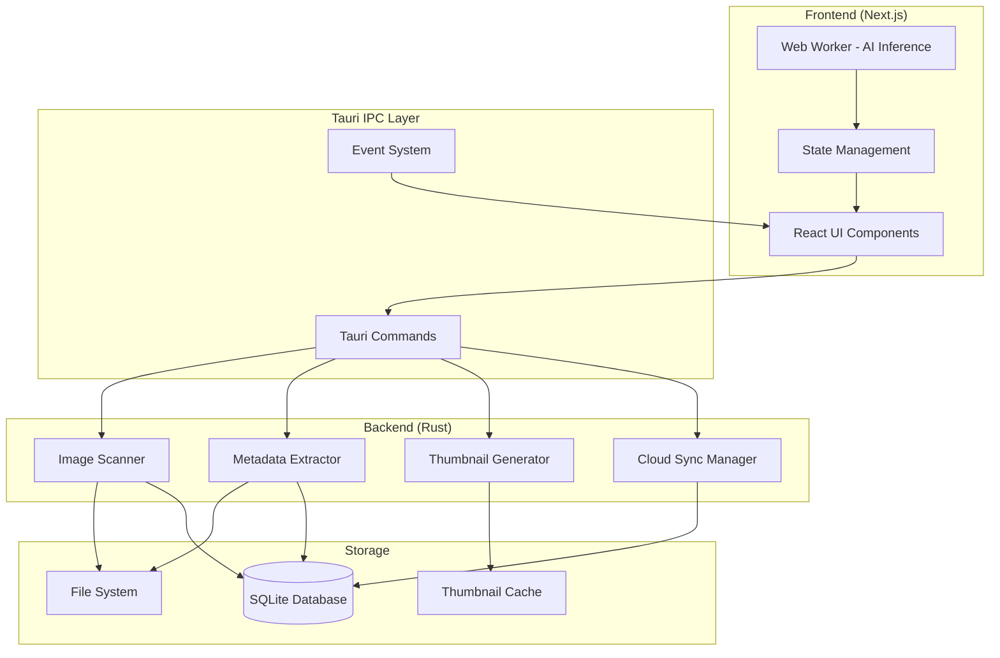

# Design Document - Cura Photo Manager

## Overview

Cura is a desktop photo management application built on a hybrid architecture combining Rust (Tauri backend) for high-performance image processing with Next.js (React frontend) for a modern, responsive user interface. The system leverages browser-based AI models through Transformers.js for intelligent photo classification while maintaining native performance for I/O-intensive operations.

### Architecture Philosophy

The design follows a clear separation of concerns:
- **Rust Backend**: Handles all filesystem operations, image processing, and metadata extraction
- **Next.js Frontend**: Manages UI rendering, user interactions, and AI inference
- **IPC Bridge**: Tauri's command system provides type-safe communication between layers
- **Local-First**: All core functionality works offline; cloud sync is an optional enhancement

### Key Design Decisions

1. **Dual Thumbnail Strategy**: Generate both 150px (grid) and 600px (detail) thumbnails to optimize for different viewing contexts
2. **Parallel Processing**: Use Rayon for CPU-bound tasks to maximize throughput on multi-core systems
3. **Browser-Based AI**: Run inference in web workers to avoid blocking the UI thread
4. **Incremental Indexing**: Process images in batches with progress feedback rather than blocking on large imports
5. **Checksum-Based Sync**: Use content hashing to avoid redundant uploads to Google Drive

## Architecture

### System Components



### Data Flow

**Image Import Flow**:
1. User selects folder via Tauri dialog
2. Rust scanner traverses directory tree in parallel
3. For each image:
   - Extract metadata (EXIF, file stats)
   - Generate small (150px) and medium (600px) thumbnails
   - Store metadata and paths in SQLite
   - Emit progress event to frontend
4. Frontend receives thumbnail paths and displays grid
5. AI worker processes thumbnails in background queue
6. Tags are saved to database as they're generated

**Search Flow**:
1. User enters search query in UI
2. If text-based: Query SQLite for matching tags/metadata
3. If semantic (CLIP): Compute query embedding in worker
4. Compare against stored image embeddings
5. Return ranked results to UI

**Cloud Sync Flow**:
1. User authenticates via OAuth 2.0 (browser popup)
2. Tokens stored in system keychain via Rust
3. On sync request:
   - Query database for images not yet synced
   - Compute checksum for each image
   - Compare with Drive API to identify new files
   - Stream upload new/modified images
   - Update sync status in database

## Components and Interfaces

### Rust Backend Components

#### Image Scanner

**Responsibility**: Discover image files in directory trees

**Interface**:
```rust
#[tauri::command]
async fn scan_folder(path: String) -> Result<ScanResult, String> {
    // Returns list of discovered image paths
}

struct ScanResult {
    images: Vec<ImagePath>,
    total_count: usize,
    errors: Vec<ScanError>,
}
```

**Implementation Details**:
- Use `walkdir` crate for recursive traversal
- Filter by extension: `.jpg`, `.jpeg`, `.png`, `.heic`, `.raw`, `.cr2`, `.nef`
- Use Rayon's `par_bridge()` to parallelize file discovery
- Emit progress events every 100 files processed

#### Metadata Extractor

**Responsibility**: Read EXIF data and file system metadata

**Interface**:
```rust
#[tauri::command]
async fn extract_metadata(image_path: String) -> Result<ImageMetadata, String> {
    // Returns structured metadata
}

struct ImageMetadata {
    path: String,
    capture_date: Option<DateTime<Utc>>,
    camera_make: Option<String>,
    camera_model: Option<String>,
    gps_latitude: Option<f64>,
    gps_longitude: Option<f64>,
    width: u32,
    height: u32,
    file_size: u64,
    file_modified: DateTime<Utc>,
}
```

**Implementation Details**:
- Use `kamadak-exif` crate for EXIF parsing
- Fallback to file system timestamps if EXIF date missing
- Parse GPS coordinates from EXIF rational format to decimal degrees
- Handle orientation tag to determine correct dimensions
- Target: <100ms per image on average

#### Thumbnail Generator

**Responsibility**: Create cached preview images

**Interface**:
```rust
#[tauri::command]
async fn generate_thumbnails(image_path: String) -> Result<ThumbnailPaths, String> {
    // Returns paths to generated thumbnails
}

struct ThumbnailPaths {
    small: String,  // 150px width
    medium: String, // 600px width
}
```

**Implementation Details**:
- Use `image` crate for decoding and resizing
- For HEIC: Use `libheif-rs` to decode, then convert to JPEG
- For RAW: Use `rawloader` crate to decode, then convert to JPEG
- Apply EXIF orientation transformation before resizing
- Use Lanczos3 filter for high-quality downsampling
- Cache location: `{AppData}/cura/thumbnails/{checksum}_{size}.jpg`
- Skip generation if thumbnail exists and source file unchanged (compare mtime)

#### Cloud Sync Manager

**Responsibility**: Handle Google Drive authentication and file uploads

**Interface**:
```rust
#[tauri::command]
async fn authenticate_google_drive() -> Result<AuthStatus, String> {
    // Opens browser for OAuth, returns success/failure
}

#[tauri::command]
async fn sync_to_drive(image_ids: Vec<i64>) -> Result<SyncResult, String> {
    // Uploads specified images to Google Drive
}

struct SyncResult {
    uploaded: usize,
    skipped: usize,
    failed: Vec<SyncError>,
}
```

**Implementation Details**:
- Use `oauth2` crate for OAuth 2.0 flow
- Store tokens in system keychain via `keyring` crate
- Use `reqwest` for HTTP requests to Drive API
- Stream file uploads to minimize memory usage
- Compute SHA-256 checksum for deduplication
- Implement exponential backoff for retries (3 attempts max)
- Emit progress events with percentage and current file

### Frontend Components

#### AI Classifier

**Responsibility**: Run image classification inference

**Interface**:
```typescript
// Runs in Web Worker
interface ClassificationRequest {
  thumbnailPath: string;
  imageId: number;
  modelType: 'clip' | 'mobilenet';
}

interface ClassificationResult {
  imageId: number;
  tags: Array<{
    label: string;
    confidence: number;
  }>;
}

async function classifyImage(request: ClassificationRequest): Promise<ClassificationResult>
```

**Implementation Details**:
- Load model once on worker initialization
- Use `@xenova/transformers` library
- For CLIP: Generate embeddings for both image and text queries
- For MobileNet: Use top-5 predictions above 0.3 confidence threshold
- Process images in queue (max 2 concurrent to limit memory)
- Send results back to main thread via postMessage
- Main thread saves tags to database via Tauri command

#### UI Components

**Photo Grid**:
- Use `react-window` for virtual scrolling
- Display small thumbnails (150px) in responsive grid
- Show skeleton loaders while thumbnails load
- Support infinite scroll for large collections

**Photo Detail View**:
- Display medium thumbnail (600px) initially
- Lazy load full-resolution image on demand
- Show metadata panel with EXIF information
- Display AI-generated tags with confidence scores
- Provide map view if GPS coordinates available

**Search Interface**:
- Text input with debounced search (300ms)
- Filter chips for tags, date ranges, locations
- Toggle between tag search and semantic search (if CLIP enabled)
- Display result count and search time

### Database Schema

**SQLite Tables**:

```sql
CREATE TABLE images (
    id INTEGER PRIMARY KEY AUTOINCREMENT,
    path TEXT NOT NULL UNIQUE,
    thumbnail_small TEXT NOT NULL,
    thumbnail_medium TEXT NOT NULL,
    checksum TEXT NOT NULL,
    capture_date DATETIME,
    camera_make TEXT,
    camera_model TEXT,
    gps_latitude REAL,
    gps_longitude REAL,
    width INTEGER NOT NULL,
    height INTEGER NOT NULL,
    file_size INTEGER NOT NULL,
    file_modified DATETIME NOT NULL,
    created_at DATETIME DEFAULT CURRENT_TIMESTAMP,
    synced_at DATETIME,
    sync_status TEXT DEFAULT 'pending'
);

CREATE TABLE tags (
    id INTEGER PRIMARY KEY AUTOINCREMENT,
    image_id INTEGER NOT NULL,
    label TEXT NOT NULL,
    confidence REAL NOT NULL,
    created_at DATETIME DEFAULT CURRENT_TIMESTAMP,
    FOREIGN KEY (image_id) REFERENCES images(id) ON DELETE CASCADE
);

CREATE TABLE embeddings (
    id INTEGER PRIMARY KEY AUTOINCREMENT,
    image_id INTEGER NOT NULL UNIQUE,
    embedding BLOB NOT NULL,
    model_version TEXT NOT NULL,
    created_at DATETIME DEFAULT CURRENT_TIMESTAMP,
    FOREIGN KEY (image_id) REFERENCES images(id) ON DELETE CASCADE
);

CREATE INDEX idx_images_path ON images(path);
CREATE INDEX idx_images_capture_date ON images(capture_date);
CREATE INDEX idx_images_sync_status ON images(sync_status);
CREATE INDEX idx_tags_image_id ON tags(image_id);
CREATE INDEX idx_tags_label ON tags(label);
```

## Data Models

### Core Domain Models

**Image Record**:
```typescript
interface ImageRecord {
  id: number;
  path: string;
  thumbnailSmall: string;
  thumbnailMedium: string;
  checksum: string;
  metadata: ImageMetadata;
  tags: Tag[];
  syncStatus: 'pending' | 'synced' | 'failed';
  syncedAt?: Date;
}

interface ImageMetadata {
  captureDate?: Date;
  cameraMake?: string;
  cameraModel?: string;
  gpsCoordinates?: {
    latitude: number;
    longitude: number;
  };
  dimensions: {
    width: number;
    height: number;
  };
  fileSize: number;
  fileModified: Date;
}

interface Tag {
  label: string;
  confidence: number;
}
```

**Search Query**:
```typescript
interface SearchQuery {
  text?: string;
  tags?: string[];
  dateRange?: {
    start: Date;
    end: Date;
  };
  location?: {
    latitude: number;
    longitude: number;
    radiusKm: number;
  };
  cameraModel?: string;
  semantic?: boolean; // Use CLIP semantic search
}

interface SearchResult {
  images: ImageRecord[];
  totalCount: number;
  searchTimeMs: number;
}
```

**Sync Configuration**:
```typescript
interface SyncConfig {
  enabled: boolean;
  autoSync: boolean;
  syncInterval: number; // minutes
  uploadQuality: 'original' | 'high' | 'medium';
  excludePatterns: string[]; // glob patterns
}
```

### State Management

**Frontend State**:
```typescript
interface AppState {
  images: {
    items: Map<number, ImageRecord>;
    selectedFolder: string | null;
    viewMode: 'grid' | 'detail';
    selectedImageId: number | null;
  };
  
  search: {
    query: SearchQuery;
    results: number[];
    isSearching: boolean;
  };
  
  ai: {
    isProcessing: boolean;
    queueSize: number;
    processedCount: number;
    modelLoaded: boolean;
  };
  
  sync: {
    isAuthenticated: boolean;
    isSyncing: boolean;
    progress: {
      current: number;
      total: number;
      currentFile: string;
    };
  };
  
  settings: {
    thumbnailCachePath: string;
    aiModel: 'clip' | 'mobilenet';
    syncConfig: SyncConfig;
  };
}
```


## Correctness Properties

*A property is a characteristic or behavior that should hold true across all valid executions of a system—essentially, a formal statement about what the system should do. Properties serve as the bridge between human-readable specifications and machine-verifiable correctness guarantees.*

### Property 1: Recursive Image Discovery

*For any* directory tree containing image files, scanning should discover all image files in all subdirectories and return a list where each entry contains both an original image path and corresponding thumbnail paths.

**Validates: Requirements 1.2, 1.5**

### Property 2: Format Support Completeness

*For any* valid image file in JPEG, PNG, HEIC, or RAW format, the system should successfully process it without errors.

**Validates: Requirements 1.4**

### Property 3: Error Isolation

*For any* batch of files containing some unreadable files, processing should continue for all readable files and the final result should include both successful results and logged errors for failed files.

**Validates: Requirements 1.6, 11.3**

### Property 4: Metadata Field Completeness

*For any* image with EXIF data, the extracted metadata should include capture date, camera device, GPS coordinates (if present), and image dimensions.

**Validates: Requirements 2.1**

### Property 5: Database Round-Trip Consistency

*For any* image with extracted metadata and generated tags, storing to the database and then querying back should return equivalent metadata and tags linked to the correct image path.

**Validates: Requirements 2.3, 4.3, 6.1**

### Property 6: GPS Coordinate Format

*For any* image with GPS EXIF data, the parsed coordinates should be in decimal degrees format (not degrees-minutes-seconds), with latitude in range [-90, 90] and longitude in range [-180, 180].

**Validates: Requirements 2.4**

### Property 7: Dual Thumbnail Generation

*For any* processed image, thumbnail generation should produce exactly two files: one with 150px width (small) and one with 600px width (medium), both maintaining the original aspect ratio.

**Validates: Requirements 3.1**

### Property 8: Format Conversion for Compatibility

*For any* HEIC or RAW format input image, the generated thumbnails should be in JPEG format to ensure browser compatibility.

**Validates: Requirements 3.2**

### Property 9: Thumbnail Generation Idempotence

*For any* image, generating thumbnails twice without modifying the source image should skip regeneration on the second attempt and return the existing thumbnail paths.

**Validates: Requirements 3.4, 10.3**

### Property 10: Orientation Preservation

*For any* image with an EXIF orientation tag, the generated thumbnails should be rotated correctly according to the orientation value.

**Validates: Requirements 3.6**

### Property 11: Classification Output Structure

*For any* image processed by the AI classifier, the result should contain at least one tag with a label and confidence score.

**Validates: Requirements 4.2**

### Property 12: Semantic Search with CLIP

*For any* natural language search query when using the CLIP model, the system should return a ranked list of images based on semantic similarity.

**Validates: Requirements 4.6**

### Property 13: Search Result Ordering

*For any* search results, images should be ordered by relevance score in descending order (highest relevance first).

**Validates: Requirements 5.2**

### Property 14: Database Query Filtering

*For any* filter criteria (date range, location, tags, or device), querying the database should return only images that match all specified criteria.

**Validates: Requirements 6.2**

### Property 15: Referential Integrity

*For any* image record, deleting the image from the database should automatically cascade delete all associated tags due to foreign key constraints.

**Validates: Requirements 6.4**

### Property 16: Cleanup on Deletion

*For any* image deleted from disk, the system should remove the corresponding database record and all cached thumbnail files.

**Validates: Requirements 6.5**

### Property 17: Path Update on Move

*For any* image moved within monitored folders, the system should update the existing database record's path rather than creating a duplicate entry (based on checksum matching).

**Validates: Requirements 6.6**

### Property 18: Token Persistence

*For any* successful OAuth authentication, the access_token and refresh_token should be stored in the system keychain and be retrievable in subsequent sessions.

**Validates: Requirements 7.2**

### Property 19: Automatic Token Refresh

*For any* expired access_token, the system should automatically obtain a new access_token using the refresh_token without requiring user re-authentication.

**Validates: Requirements 7.4**

### Property 20: Checksum-Based Deduplication

*For any* set of images selected for backup, only images whose checksums do not exist in Google Drive should be uploaded.

**Validates: Requirements 8.1**

### Property 21: Sync Status Tracking

*For any* image successfully uploaded to Google Drive, the database should record the sync status as "synced" and store the sync timestamp.

**Validates: Requirements 8.3**

### Property 22: Error Logging Structure

*For any* error that occurs in the system, the log entry should contain a timestamp, component name, and stack trace.

**Validates: Requirements 11.1**

### Property 23: Data Preservation on Crash

*For any* application crash, restarting the application should show all previously imported images and metadata without data loss or corruption.

**Validates: Requirements 11.5**

### Property 24: Settings Persistence Round-Trip

*For any* configuration change, saving the settings and restarting the application should preserve the changed values.

**Validates: Requirements 12.2, 12.3**

### Property 25: Settings Validation

*For any* invalid configuration value, the system should reject the input and provide a descriptive error message explaining why the value is invalid.

**Validates: Requirements 12.4**

## Error Handling

### Error Categories

**File System Errors**:
- Unreadable files: Log error, continue processing other files
- Permission denied: Display user-friendly message, suggest checking permissions
- Disk full: Pause operations, notify user, allow cleanup

**Image Processing Errors**:
- Corrupt image data: Log error, display placeholder thumbnail
- Unsupported format: Log warning, skip file
- EXIF parsing failure: Use fallback values (file system metadata)

**AI Inference Errors**:
- Model loading failure: Disable AI features, notify user
- Out of memory: Reduce batch size, retry with smaller batches
- Worker thread crash: Restart worker, resume from last checkpoint

**Network Errors**:
- OAuth failure: Display error, allow retry
- Upload failure: Retry with exponential backoff (3 attempts)
- Token refresh failure: Prompt user to re-authenticate

**Database Errors**:
- Schema initialization failure: Display error, prevent app startup
- Query failure: Log error, return empty results
- Constraint violation: Log error, rollback transaction

### Error Recovery Strategies

**Graceful Degradation**:
- If AI classification fails, app continues with manual tagging
- If cloud sync fails, app continues with local-only mode
- If thumbnail generation fails, display placeholder icons

**Transactional Operations**:
- Database writes use transactions with rollback on error
- Batch operations checkpoint progress for resume capability
- File operations are atomic where possible

**User Communication**:
- Critical errors: Modal dialog with clear explanation
- Non-critical errors: Toast notification with dismiss option
- Background errors: Error log accessible from settings

## Testing Strategy

### Dual Testing Approach

The testing strategy combines unit tests for specific examples and edge cases with property-based tests for universal correctness guarantees. Both approaches are complementary and necessary for comprehensive coverage.

**Unit Tests**:
- Specific examples demonstrating correct behavior
- Edge cases (empty inputs, boundary values, special characters)
- Error conditions and recovery paths
- Integration points between components

**Property-Based Tests**:
- Universal properties that hold for all inputs
- Comprehensive input coverage through randomization
- Minimum 100 iterations per property test
- Each test references its design document property

### Property-Based Testing Configuration

**Library Selection**:
- Rust: Use `proptest` crate for backend components
- TypeScript: Use `fast-check` library for frontend components

**Test Tagging**:
Each property test must include a comment tag:
```rust
// Feature: cura-photo-manager, Property 5: Database Round-Trip Consistency
#[proptest]
fn test_metadata_roundtrip(metadata: ImageMetadata) {
    // Test implementation
}
```

**Iteration Count**:
Configure all property tests to run minimum 100 iterations:
```rust
proptest! {
    #![proptest_config(ProptestConfig::with_cases(100))]
    // Test cases
}
```

### Test Coverage by Component

**Image Scanner**:
- Unit: Test with known directory structures
- Property: Recursive discovery completeness (Property 1)
- Property: Format support (Property 2)
- Property: Error isolation (Property 3)

**Metadata Extractor**:
- Unit: Test with sample images with known EXIF data
- Property: Metadata field completeness (Property 4)
- Property: GPS coordinate format (Property 6)
- Unit: Test fallback to file system timestamps

**Thumbnail Generator**:
- Unit: Test with sample images of each supported format
- Property: Dual thumbnail generation (Property 7)
- Property: Format conversion (Property 8)
- Property: Idempotence (Property 9)
- Property: Orientation preservation (Property 10)

**AI Classifier**:
- Unit: Test with known images and expected tags
- Property: Classification output structure (Property 11)
- Property: Semantic search (Property 12)
- Unit: Test worker thread isolation

**Database**:
- Property: Round-trip consistency (Property 5)
- Property: Query filtering (Property 14)
- Property: Referential integrity (Property 15)
- Property: Cleanup on deletion (Property 16)
- Property: Path update on move (Property 17)
- Unit: Test schema initialization

**Cloud Sync**:
- Unit: Test OAuth flow with mock server
- Property: Token persistence (Property 18)
- Property: Automatic token refresh (Property 19)
- Property: Checksum-based deduplication (Property 20)
- Property: Sync status tracking (Property 21)
- Unit: Test retry logic with exponential backoff

**Error Handling**:
- Property: Error logging structure (Property 22)
- Property: Data preservation on crash (Property 23)
- Unit: Test each error category with specific scenarios

**Settings Management**:
- Property: Settings persistence round-trip (Property 24)
- Property: Settings validation (Property 25)
- Unit: Test default values on first run

### Integration Testing

**End-to-End Flows**:
1. Import folder → Scan → Extract metadata → Generate thumbnails → Display grid
2. Select image → Display detail view → Show metadata and tags
3. Search by tag → Filter results → Display matches
4. Authenticate Drive → Select images → Upload → Verify sync status

**Performance Testing**:
- Benchmark scanning 10,000 images
- Measure thumbnail generation throughput
- Test AI classification batch processing
- Verify search response time under load

### Test Data Generation

**Property Test Generators**:
```rust
// Generate random directory structures
prop_compose! {
    fn arb_directory_tree()(
        depth in 1..5usize,
        files_per_dir in 1..20usize
    ) -> DirectoryTree {
        // Generate random tree structure
    }
}

// Generate random image metadata
prop_compose! {
    fn arb_image_metadata()(
        width in 100..10000u32,
        height in 100..10000u32,
        has_gps in proptest::bool::ANY,
        lat in -90.0..90.0f64,
        lon in -180.0..180.0f64
    ) -> ImageMetadata {
        // Generate random metadata
    }
}
```

**Edge Cases to Cover**:
- Empty directories
- Very large images (>100MB)
- Images with missing EXIF data
- Images with corrupt EXIF data
- Unicode characters in file paths
- Very long file paths (>260 characters on Windows)
- Images with unusual aspect ratios
- Images with all 8 EXIF orientation values

### Continuous Integration

**CI Pipeline**:
1. Run all unit tests
2. Run all property tests (100 iterations each)
3. Run integration tests
4. Generate coverage report (target: >80%)
5. Run linters and formatters
6. Build release artifacts

**Test Execution Time**:
- Unit tests: <30 seconds
- Property tests: <5 minutes
- Integration tests: <2 minutes
- Total CI time: <10 minutes
